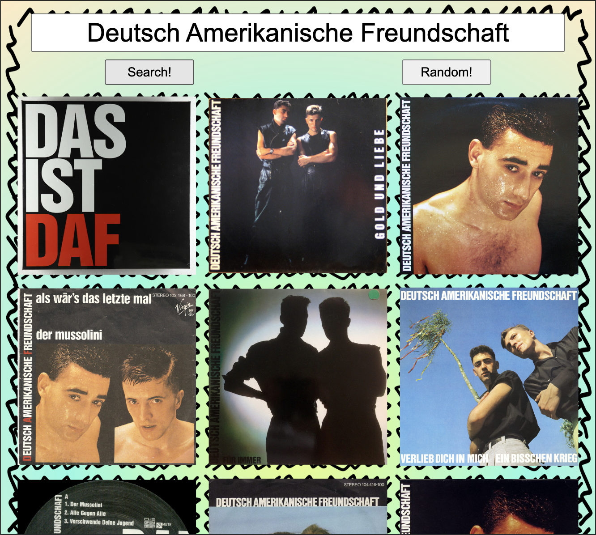

<h1 style="text-align: center;"> -- reSearch Music with Images -- </h1>

A simple program that interacts with the discogs.com database. Search for music without alogrithims(sort of)

 'Search!': Enter a search term, hit enter or search and reSearch will give you 10 images from Discogs'search. *Bonus click search again and diffrent results should come up if there's more than 10.   Click on an image that interests you and the image will enlarge and three links will appear. 
<ol>
    <li>The first link ('discogs link') will take you to the artist, label, or release on Discogs.com. 
    </li>
    <li>The second button ('reSearch') will take the title or artist name from your selection and 'reSearch' the term.
    </li>The third link will take you to the first video link posted on the Discogs release page.
    <li>
</ol>

